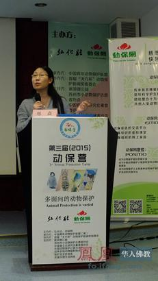

# 弘化社与动保网联合举办2015第三届动物保护夏令营闭营（凤凰网报道）

{: .center}

2015年7月24日，第三届动保营在苏州弘化社闭营，本届动保营由弘化社和动保网联合主办，首届“天方杯”动物保护新闻奖组委会协办，由中国青年动物保护联盟（筹）承办，凤凰网佛教频道、新浪微公益、济溪环境交流网络提供媒体支持。其他支持单位有（排名不分先后）：中国食文化研究会素食委员会、中国动物保护记者沙龙、世界农场动物福利协会、苏州市小动物保护志愿者协会、保护地友好体系等。本届动保营的主题是多面向的动物保护。在总结前两届动保营得失之后，在举办模式、聘请讲师、内容选择、日程安排，都做了精心的调整。本届动保夏令营为期六天，专门为大学生举办的动保夏令营，旨在打造中国动保青年黄埔军校，来自全国21个省51个城市约70位高校精英代表参营。

下午3点，动保营隆重的闭营仪式在苏州乐园度假酒店举行，由清华大学科学技术与社会研究所副教授、动保网联合创办人蒋劲松主持，弘化社总干事长宋浩致闭营辞，弘化社真心法师致辞，动保讲师代表四川农业大学副教授陈焱致辞，优秀营员代表清华大学学生韩君发表闭营感言，真心法师给全体合格的营员颁发结业证书并合影留念。

本届夏令营得到了江苏金湖县西安寺的大力支持，源了大和尚不仅关心课程设置，指导义工培训，还亲自授课。夏令营讲师整容强大，汇聚了国内动物保护与素食界的精英，分别来自：中国科学院、中国农业大学、清华大学、中国地质大学、四川农业大学、中国美术学院、厦门大学、海南师范大学、嘉应学院，以及国际国内动保组织。如海南师范大学副校长史海涛教授，在飞赴日本开会前夕，挤时间来到苏州讲授龟鳖类动物保护。课程不仅涵盖了动保与素食的各项议题，理论联系实际，还邀请了新浪微公益新媒体负责人，讲授如何利用新媒体传播公益的方法，还有诸如“动物保护与反对大屠杀教育”、“呵护人类生命的青年两性交往之道”的内容，比前两届动保营大幅度扩展了动保教育的视野。本届动保营还安排了动保议题的辩论赛，旨在锻炼同学们动保论述能力，提高中国动保人与社会公众之间的沟通能力。

整个动保营安排了丰富的课程，绝对是一场动保的盛宴，有如下课程：厦门大学生态学教授、全国绿色营指导老师李振基介绍了大学生绿色营，中国农业大学博士刘琰介绍了浅谈实验动物福利嘉应学院教授，《向肉食说NO》作者、北京大学哲学博士、中国社科院社会学所博士后田永胜介绍了素食与健康，中科院动物研究所副研究员，保护地友好体系发起人，世界自然保护联盟物种生存委员会执委，曾任国际动物学会秘书，国际野生生物保护学会（WCS）中国项目部主任解焱介绍了中国野生动物保护研究与行动（以东北虎清套计划为例），中国美术学院教授张辛可介绍动物保护与人类文明的进步，中国农业大学人文与发展学院科技管理系教授李建军介绍西方伦理学与动物保护，北京麋鹿生态实验中心副主任郭耕介绍我与动物保护：生态、生命、生活，世界农场动物福利协会中国总监周尊国农场动物的福利状况与保护，清华大学教授、动保网联合创办人蒋劲松介绍客观理性看放生，新浪微公益新媒体传播总监余哲介绍如何用社交媒体传播公益，苏州小动物保护志愿者协会会长介绍苏州小动物保护协会救助伴侣动物的经验总结，亚洲动物基金中国猫狗福利经理邓轶丹介绍猫狗肉黑色产业链的违法性质，清华大学副教授蒋劲松介绍中国传统文化的动物保护观，西安寺住持源了大和尚介绍印光大师的素食护生思想简介，四川农业大学副教授陈焱介绍敬畏生命的维度及其意义，中国地质大学人文经管学院副教授李山梅介绍呵护人类生命的青年两性交往之道，中国食文化研究会素食委员会副主任、南京大学动保素食读书会创始人杨冠群介绍动物保护与反对大屠杀教育，海南师范大学副校长史海涛介绍龟鳖动物的保护，弘化社编辑组负责人、护生组负责人钏有庄、张培培介绍弘化社护生实践与宣传，中国青年动物保护联盟理事长、动保网联合创办人介绍如何在大学校园开展动物保护宣传等等。

弘化社是印光大师创办的印经弘法组织，在海内外佛教信众中具有崇高的威望，长期以来，重视佛教护生素食理念的传播，最近对于如何推动佛教放生的规范化也进行了深入的思考和研讨。动保网是国内宣传动物保护理念的知名网站，致力于动保力量的整合，最近尤其是在促进动保界与佛教界的合作方面做了很多工作，很有成效。弘化社与动保网合作举办大学生动保营，优势互补，是佛教界与动保界的又一次强强联合。

弘化社：http://www.honghuashe.com/

弘化社由净土宗第十三代祖师印光大师于1931年4月创办于上海，并于同年迁至苏州报国寺，以印赠善书为主。

2003年，弘化社印经法务在明学长老的指导下，于苏州报国寺恢复。2013年5月8日，经江苏省民政厅正式批准成立“苏州弘化社慈善基金会”主要开展的公益活动方面有环保护生、慈幼安老、养老济贫、印送善书、救助病苦等慈善项目。

